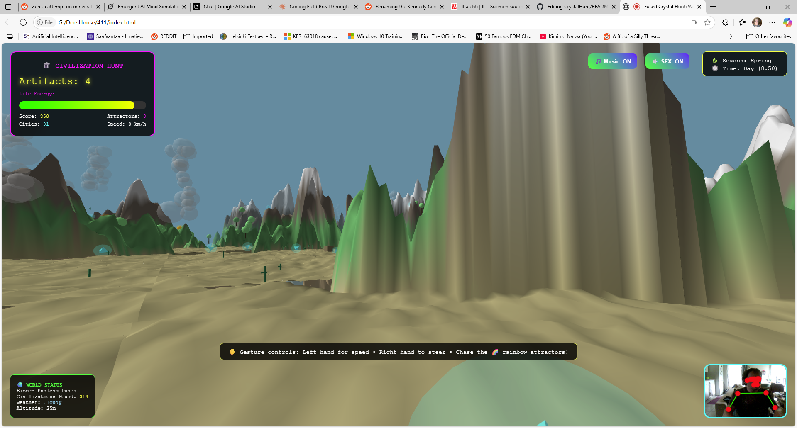

# 🏛️ Enhanced Crystal Hunt: Civilization World - Gesture-Controlled Adventure



**Explore infinite procedural worlds with ancient civilizations using your body as the controller!** This revolutionary gesture-controlled adventure combines computer vision, procedural generation, spatial audio, and historical discovery into an immersive exploration experience.

## 🚀 [Play Now](https://anttiluode.github.io/enhanced-crystal-hunt/)

> **Note**: Requires webcam access for gesture controls. Works best in Chrome/Edge browsers with good lighting.

## 🎮 Game Overview

Enhanced Crystal Hunt: Civilization World is a groundbreaking browser-based adventure where players use **full-body movements** to fly through procedurally generated 3D worlds filled with ancient civilizations, rainbow attractors, and mystical artifacts. Each discovery produces unique sounds and visual effects, creating a truly synesthetic exploration experience.

### 🎯 Objectives
- **🏛️ Discover ancient civilizations** - temples, pyramids, and lost cities
- **💎 Collect civilization artifacts** to restore your life energy
- **🌈 Chase rainbow attractors** for massive point bonuses and meow sounds
- **🌍 Survive and explore** infinite procedural worlds
- **⭐ Master advanced gesture controls** for precision flight

### ✨ Revolutionary Features

#### 🏛️ **Procedural Civilizations**
- **Ancient Temples** with legendary artifacts (500 pts)
- **Mysterious Pyramids** surrounded by rare treasures (200 pts)
- **Lost Cities** with scattered relics (75 pts)
- **Flattened terrain** where civilizations naturally emerge

#### 🌈 **Infinite Attractors**
- **Rainbow spheres** that fly through the world with colorful trails
- **Confined flight patterns** (30-200m altitude as specified)
- **Meow sounds** when caught (+1000 points!)
- **Limited spawning** (max 3 at once) for balanced challenge

#### ☁️ **3D Volumetric Clouds**
- **Multi-sphere cloud formations** drifting across the sky
- **Dynamic weather systems** affecting visibility
- **Time-of-day opacity** changes for realistic atmosphere

#### 🌿 **Living World Systems**
- **Dynamic seasons** (Spring → Summer → Autumn → Winter)
- **Day/night cycles** with moving sun and lighting
- **Weather patterns** based on cloud density
- **Biome detection** (Ocean, Forest, Hills, Mountains, Alpine)

#### 🎵 **Enhanced Audio Experience**
- **Procedural ambient music** with chord progressions
- **Artifact-specific sounds** (different tones for legendary/rare/normal)
- **Rainbow attractor meows** using filtered oscillators
- **Sound controls** (Music ON/OFF, SFX ON/OFF)

## 🎮 Advanced Controls

### 🎛️ **Gesture Controls** (Primary)
| Gesture | Action | Description |
|---------|--------|-------------|
| **✋ Left Hand Height** | Speed Control | Raise hand = faster flight (up to 280 km/h) |
| **🤲 Right Hand Position** | Precision Steering | Move hand for left/right/up/down control |
| **🗣️ Head Tilt** | Banking & Roll | Tilt head for realistic flight banking |
| **📷 Body Presence** | Auto-Detection | Real-time pose tracking with visual feedback |

### ⌨️ **Enhanced Keyboard Controls**
| Key | Action | Key | Action |
|-----|--------|-----|--------|
| `W/S` or `↑/↓` | Speed control | `M` | Toggle music |
| `A/D` or `←/→` | Steering | `N` | Toggle sound effects |
| `Q/E` | Roll left/right | `T` | Fast-forward time |
| `R` | Reset position | `C` | Change season manually |

### 💎 **Artifact Types & Values**

| Type | Appearance | Energy | Points | Rarity | Found Near |
|------|------------|--------|--------|--------|------------|
| **🏛️ Legendary** | Gold Dodecahedron | +50 | +500 | Ultra Rare | Ancient Temples |
| **💎 Rare** | Orange Octahedron | +35 | +200 | Rare | Pyramid Sites |
| **⚱️ Relic** | Cyan Tetrahedron | +25 | +75 | Common | Lost Cities |
| **🌈 Rainbow Attractor** | Color-shifting Sphere | +40 | +1000 | Special | Flying Freely |

## 🛠️ Technical Innovations

### 🎨 **Advanced Graphics & Rendering**
- **Three.js WebGL** with enhanced shadow mapping (4096×4096)
- **Multi-octave terrain** with civilization-influenced flattening
- **Seasonal color systems** affecting all vegetation
- **Dynamic lighting** with sun position based on time of day
- **Volumetric cloud rendering** with multi-sphere formations

### 👁️ **Computer Vision Excellence**
- **MediaPipe Pose** for full-body tracking (40 landmarks)
- **Enhanced gesture recognition** with smoothing and thresholds
- **Real-time visual feedback** showing pose connections
- **Visibility-based controls** preventing erratic movement

### 🎵 **Procedural Audio Systems**
- **Web Audio API** with complex filter chains
- **Frequency-mapped artifacts** (150-750 Hz range)
- **Multi-oscillator meow synthesis** with lowpass filtering
- **Ambient music loops** with Am chord progressions

### 🌍 **Advanced World Generation**
- **Infinite chunked terrain** (400×400 unit chunks)
- **5-octave Simplex noise** for realistic mountain generation
- **Civilization noise influence** creating natural building sites
- **Dynamic object spawning** (trees, artifacts, clouds, attractors)
- **Biome-based coloring** with seasonal modifiers

### 📋 **Enhanced Requirements**
- **Modern browser** (Chrome 90+, Firefox 88+, Safari 14+)
- **Webcam with good lighting** for optimal pose detection
- **HTTPS connection** (required for MediaPipe)
- **WebGL support** for 3D rendering
- **Web Audio API** support for procedural sounds

## 🎯 **Advanced Game Mechanics**

### ⚡ **Energy Management System**
- **Starting energy**: 100% life force
- **Decay rate**: 0.6% per second (reduced from original)
- **Artifact restoration**: +25/35/50 energy based on type
- **Visual feedback**: Color-coded energy bar (green→yellow→red)

### 🎮 **Enhanced Flight Physics**
- **Base speed**: 1200 units/second + gesture boost
- **Gesture speed**: Up to 280 km/h additional
- **Banking system**: Head tilt creates realistic roll
- **Altitude constraints**: 25-800 meter flight envelope
- **Momentum-based movement** with enhanced inertia

### 🏆 **Advanced Scoring System**
- **Artifact collection**: 75/200/500 points by type
- **Rainbow attractors**: 1000 points + massive energy boost
- **Survival bonus**: Time-based progression
- **Discovery bonus**: Points for finding new civilizations
- **Comprehensive final score**: Artifacts × Attractors × Cities × Survival

### 🌍 **World Discovery System**
- **Biome detection**: Real-time terrain analysis
- **Civilization tracking**: Automatic discovery counting
- **Weather monitoring**: Cloud density affects conditions
- **Altitude tracking**: Current flight height display

## 🎨 **Enhanced Visual Design**

### 🌈 **Evolved Art Style**
- **Procedural civilizations** with authentic ancient architecture
- **Rainbow attractor trails** with HSL color cycling
- **Seasonal terrain coloring** affecting all world elements
- **Volumetric cloud systems** with realistic drift patterns
- **Enhanced crystal effects** with type-specific geometries

### 🎭 **Professional UI/UX**
- **Multi-panel HUD** with civilization tracking
- **Season and time indicators** in top-right corner
- **World status panel** showing biome and weather
- **Real-time webcam feed** with pose overlay
- **Audio control buttons** for music and SFX

## 🔊 **Sophisticated Audio Design**

### 🎵 **Procedural Audio Evolution**
Each game element generates unique audio signatures:
- **Artifact frequencies**: Mathematical position mapping (150-750 Hz)
- **Type-based modifiers**: Legendary (×1.5), Rare (×1.2), Normal (×1.0)
- **Rainbow attractor meows**: 3-oscillator filtered synthesis
- **Ambient music**: Scheduled Am chord progressions with filtering
- **Spatial audio effects**: Distance-based volume attenuation

## 🧪 **Technical Architecture Evolution**

```
Enhanced Crystal Hunt: Civilization World/
├── enhanced_crystal_hunt.html    # Complete game system
├── README.md                     # This enhanced documentation

### 🏗️ **Advanced Core Systems**

1. **Enhanced Gesture Recognition Pipeline**
   - MediaPipe pose detection (40-point tracking)
   - Advanced hand/head/body interpretation
   - Smoothed movement translation
   - Visibility-based control validation

2. **Procedural Civilization Engine**
   - Noise-based civilization placement
   - Dynamic structure generation (temples/pyramids/buildings)
   - Artifact spawning algorithms
   - Cultural significance modeling

3. **Living World System**
   - Seasonal progression mechanics
   - Day/night cycle simulation
   - Weather pattern generation
   - Biome classification algorithms

4. **Advanced Audio Engine**
   - Multi-track procedural synthesis
   - Frequency-mapped artifact sounds
   - Complex filter chain processing
   - Spatial audio management

5. **Rainbow Attractor System**
   - Physics-based flight patterns
   - Constraint-based movement (30-200m altitude)
   - Trail rendering with color cycling
   - Collection detection and rewards

## 🌟 **New Game Features**

### 🎮 **Enhanced Gameplay Mechanics**
- **🏛️ Civilization Discovery**: Find and explore ancient sites
- **🌈 Attractor Hunting**: Chase flying rainbow spheres
- **🌿 Seasonal Adaptation**: World changes affect gameplay
- **⏰ Time Progression**: Day/night cycles with dynamic lighting
- **🎵 Audio Customization**: Toggle music and effects independently

### 🎯 **Advanced Objectives**
- **Artifact Collection**: Discover legendary treasures in temples
- **Attractor Mastery**: Catch flying rainbow spheres for huge bonuses
- **World Exploration**: Discover all biomes and civilizations
- **Survival Endurance**: Master energy management for extended flights
- **Seasonal Expertise**: Experience all four seasons

## 🐛 **Enhanced Compatibility & Performance**

### ✅ **Optimizations**
- **Chunk-based world loading** prevents memory issues
- **Dynamic object culling** maintains 60fps performance
- **Efficient pose detection** with reduced resolution processing
- **Audio context management** prevents browser audio limitations

### ⚠️ **Known Enhancements Needed**
- **Mobile gesture controls** could be added for touch devices
- **VR support** would create even more immersive experience
- **Multiplayer exploration** could enable shared world discovery
- **Save system** for persistent world exploration progress

## 📜 **License**

This enhanced project is licensed under the **MIT License** - see the [LICENSE](LICENSE) file for details.

## 🙏 **Enhanced Acknowledgments**

### 🛠️ **Technologies Used**
- **[Three.js](https://threejs.org/)** - Advanced 3D graphics and WebGL
- **[MediaPipe](https://mediapipe.dev/)** - Professional pose detection
- **[Simplex Noise](https://github.com/jwagner/simplex-noise.js)** - Procedural world generation
- **[Web Audio API](https://developer.mozilla.org/en-US/docs/Web/API/Web_Audio_API)** - Complex audio synthesis

### 🌟 **Inspiration Sources**
- **Ancient civilizations** and archaeological discovery
- **Fractal geometry** and procedural generation techniques
- **Synesthetic art** combining visual and audio experiences
- **Gesture-based interaction** design principles

### 🎨 **Creative Influences**
- **No Man's Sky** for infinite exploration concepts
- **Journey** for atmospheric world design
- **Minecraft** for procedural world generation
- **Monument Valley** for architectural aesthetics

---

**🌍 Embark on the ultimate civilization discovery adventure!** 🏛️🌈💎

*Experience the convergence of ancient history, cutting-edge technology, and natural human movement in the most advanced gesture-controlled exploration game ever created.*
